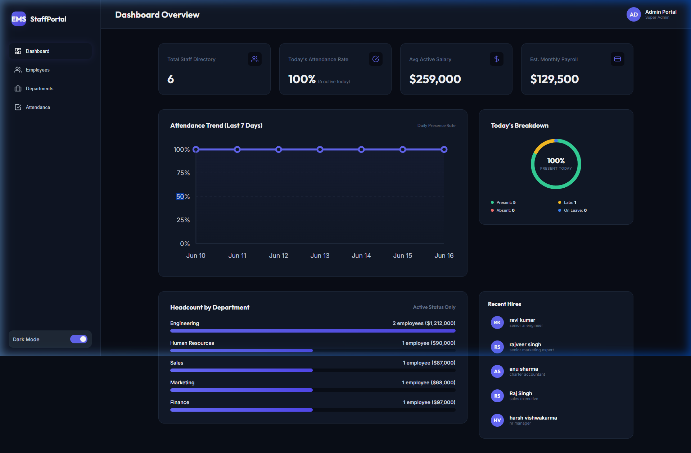
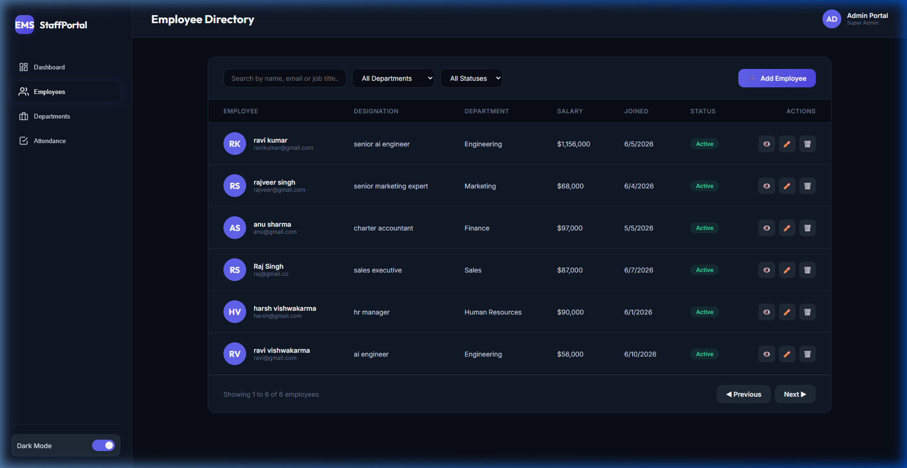
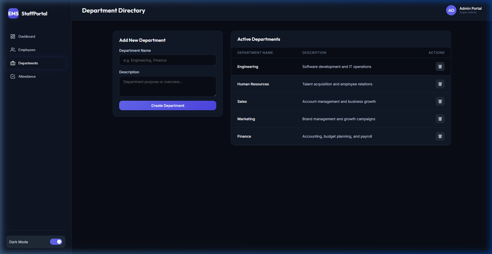
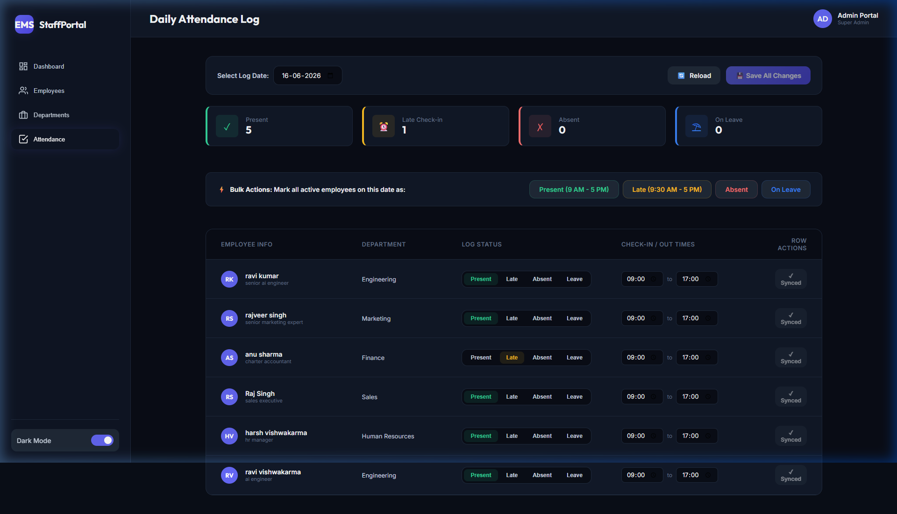
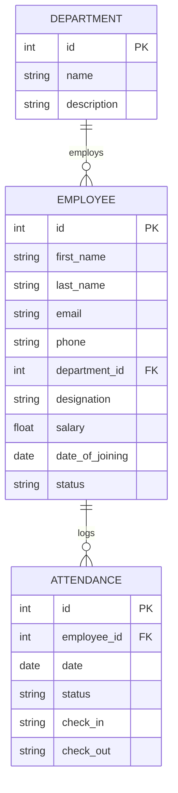

# 🌟 StaffPortal - Employee Management System (EMS)

A premium, state-of-the-art staff directory and daily attendance management portal designed for modern enterprises. Built with a robust **FastAPI** backend and a responsive **React 19 + Vite** frontend, StaffPortal provides seamless management of personnel records, organization departments, and daily work telemetry.

---

## 📋 Table of Contents
1. [Key Features](#-key-features)
2. [Visual Showcase (Screenshots)](#-visual-showcase-screenshots)
3. [Technology Stack](#-technology-stack)
4. [System Architecture & Database Schema](#-system-architecture--database-schema)
5. [API Endpoint Documentation](#-api-endpoint-documentation)
6. [Getting Started & Installation](#-getting-started--installation)
   - [Backend Setup](#1-backend-setup)
   - [Frontend Setup](#2-frontend-setup)
7. [Database Seeding](#-database-seeding)

---

## 🔑 Key Features

- 📊 **Dynamic Analytical Dashboard**:
  - Instantly track key organizational indicators: **Total Employees**, **Departments**, **Presence Rate**, and **Leave Rate**.
  - Interactive charts detailing headcount distribution by department and recent activity streams.

- 👥 **Advanced Employee Directory**:
  - Filter personnel by **Department** or **Employment Status** (Active, Inactive).
  - Search engine to lookup records by name, email, or designation.
  - Dedicated interactive **Modal Directory Cards** showing complete details (ID, phone number, salary, joining date).
  - Full CRUD functionality for adding, modifying, and offboarding staff.

- 🏢 **Department Management**:
  - Manage company business units with customizable descriptions.
  - Track department-wise allocations in real-time.

- ⏱️ **Daily Attendance Manager**:
  - Log daily status records (**Present**, **Absent**, **Late**, **On Leave**) and record check-in/check-out timestamps.
  - Perform **Bulk Logging** operations, such as marking all active employees present in one click.
  - View historically logged dates via the calendar navigation tool.

- 🌓 **Double-Theme Support**:
  - Seamlessly switch between dark-mode and light-mode configurations via the sidebar controller.

---

## 📸 Visual Showcase (Screenshots)

### 1. Dashboard Overview
The dashboard displays main telemetry metrics (Active Headcount, Departments, Present Today, and Leave Rate) alongside analytical graphics showing department distributions and a listing of the newest onboarded team members.



---

### 2. Employee Directory
A comprehensive listing of all organizational employees with column sorting, paging, search capabilities, filters, and profile modification portals.



---

### 3. Department Management
Create and organize company divisions, outlining operational details and listing all business units.



---

### 4. Daily Attendance Log
Verify daily check-ins, check-outs, and status details. Includes options for individual entry updates or bulk-logging of attendance logs.



---

## 🛠️ Technology Stack

### Backend Engine
- **FastAPI**: Asynchronous REST framework utilizing Pydantic data schemas.
- **SQLAlchemy (ORM)**: Object-relational mapping to clean database interactions.
- **SQLite**: Embedded database engine for structured SQL storage.
- **Uvicorn**: Lightweight ASGI web server for fast response times.

### Frontend Application
- **React 19**: Modern component lifecycle structure.
- **Vite**: Ultra-fast next-generation frontend tooling.
- **Vanilla CSS**: Custom styling variables and components, supporting system themes.

---

## 🗄️ System Architecture & Database Schema

The database model is composed of three interconnected relational tables:



---

## 🔌 API Endpoint Documentation

The FastAPI backend exposes the following REST endpoints:

### System Diagnostics
- `GET /api/health`: Retrieves system status and health indicator flags.

### Dashboard Data
- `GET /api/dashboard/stats`: Aggregates active statistics, department distributions, and recent hires.

### Employee Management
- `GET /api/employees`: Search, filter, and paginate through employee records.
- `GET /api/employees/{id}`: Fetch detailed record of a specific employee.
- `POST /api/employees`: Add and register a new employee profile.
- `PUT /api/employees/{id}`: Modify details of an existing profile.
- `DELETE /api/employees/{id}`: Permanently remove a record from the directory.

### Department Management
- `GET /api/departments`: Retrieve lists of all corporate departments.
- `POST /api/departments`: Add and create a new department.
- `DELETE /api/departments/{id}`: Delete an existing department.

### Attendance Management
- `GET /api/attendance`: Filter logged attendance records by date or employee ID.
- `POST /api/attendance`: Create or modify a single attendance log.
- `POST /api/attendance/bulk`: Create bulk attendance sheets (e.g. for automatic daily logging).

---

## 🚀 Getting Started & Installation

Follow these instructions to run the application locally on your computer.

### Prerequisites
- **Python 3.12+**
- **Node.js (v18+)** and **npm**

---

### 1. Backend Setup

1. Open your terminal and navigate to the backend directory:
   ```bash
   cd backend
   ```

2. Create a virtual environment and activate it:
   ```bash
   # Windows PowerShell
   python -m venv venv
   .\venv\Scripts\activate
   
   # Linux / macOS
   python3 -m venv venv
   source venv/bin/activate
   ```

3. Install all dependencies:
   ```bash
   pip install -r requirements.txt
   ```

4. Launch the FastAPI server:
   ```bash
   python -m uvicorn main:app --port 8000 --reload
   ```
   The backend API documentation will be available at [http://localhost:8000/docs](http://localhost:8000/docs).

---

### 2. Frontend Setup

1. Open a new terminal and navigate to the frontend directory:
   ```bash
   cd frontend
   ```

2. Install the node modules:
   ```bash
   npm install
   ```

3. Run the development Vite server:
   ```bash
   npm run dev
   ```
   The web portal will open at [http://localhost:5173](http://localhost:5173).

---

## 📊 Database Seeding

When the FastAPI server starts, it checks if the database is empty. If it is, it automatically seeds itself with:
- **5 Default Departments**: Engineering, Human Resources, Sales, Marketing, and Finance.
- **6 Dummy Employees** with varied salaries, statuses, and roles.
- **7 Days of Historical Attendance** logged for all employees, generating realistic work status records (Presents, Lates, Leaves, and Absences).
